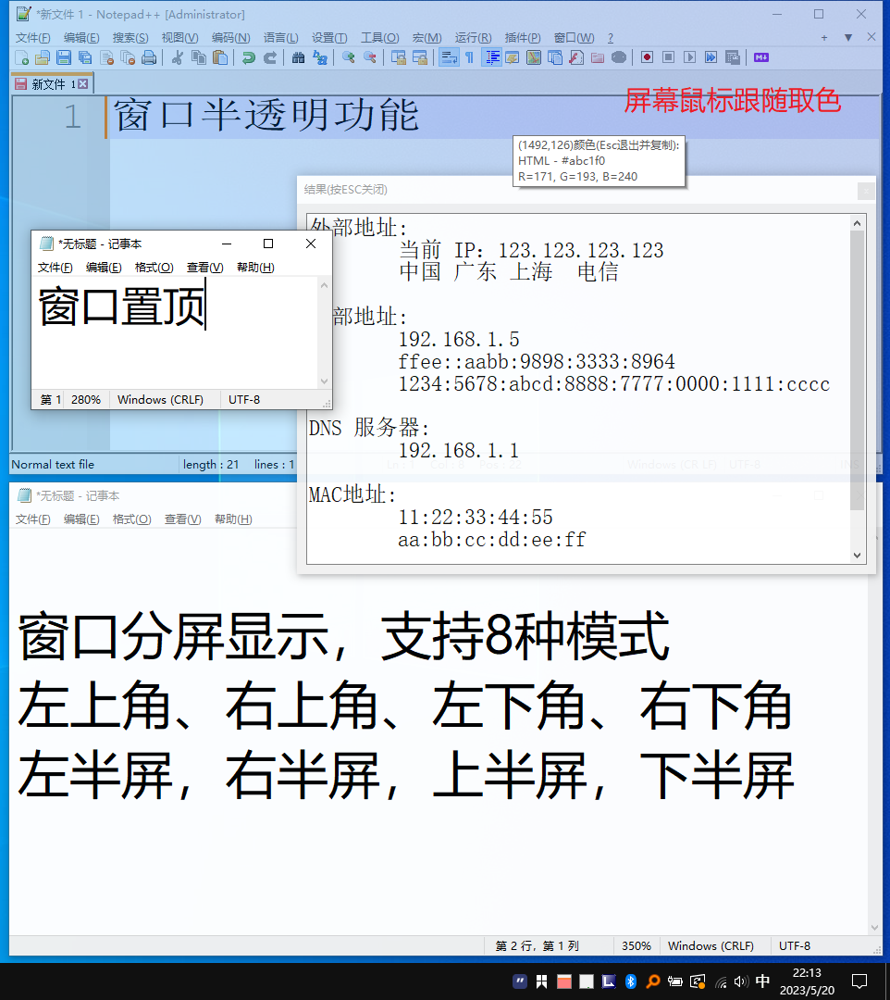
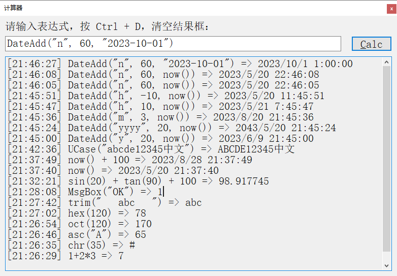
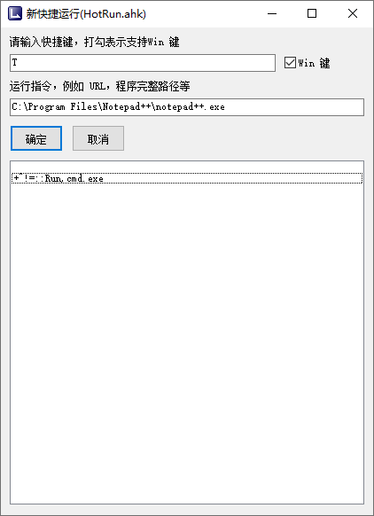
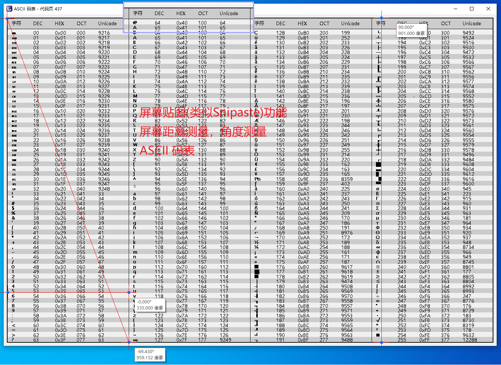
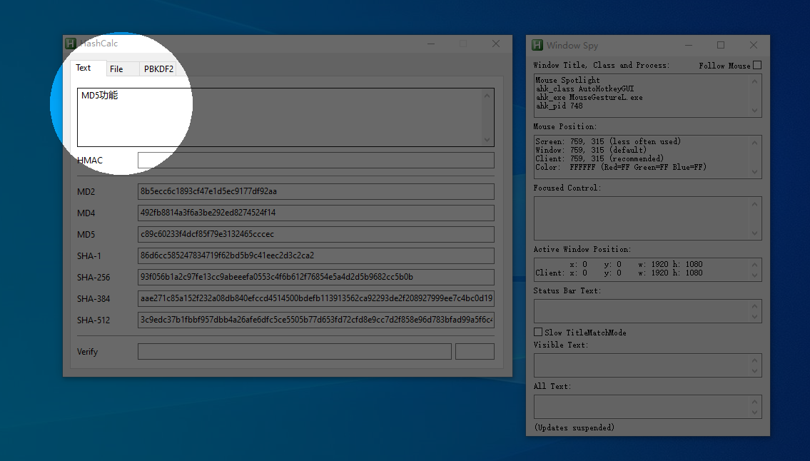

# MouseGestureL

MouseGestureL是一个极其强大的工具，并且资源消耗极低，只占用15MB内存，不消耗CPU，整个程序大小3MB，是日常办公的强力工具和助手。

## 效果图

## 功能和快捷键

* 强大的鼠标手势工具，提供下面的功能。
* 可修改Config\MG_User.ahk，更改其中一些程序运行的路径，部分程序需要安装
* MB 指的是按住鼠标右键
* 请建立 \Tools 目录，并设置系统环境变量 Path，增加 Tools 所在的路径，下载的程序请放到 Tools 目录下

| 按键                    | 动作效果                                                                               | 按键                    | 动作效果                                                                       |
|-----------------------|------------------------------------------------------------------------------------|-----------------------|----------------------------------------------------------------------------|
| MB + ←                | 后退，等价于 Alt+←                                                                       | MB + →                | 前进，等价于 Alt+→                                                               |
| MB + ↑                | 跳到开头，等价于Ctrl+Home                                                                  | MB + ↓                | 跳到末尾，等价于Ctrl+End                                                           |
| MB + ↙                | 最小化当前窗口                                                                            | MB + ↗                | 最大化当前窗口                                                                    |
| MB + 点左键              | 关闭当前窗口或网页标签                                                                        | MB + 滚轮               | 切换应用程序                                                                     |
| Win + A               | 打开[Autoruns](https://live.sysinternals.com/autoruns.exe)                           | Win + B               | 打开搜索引擎                                                                     |
| Win + C               | 打开命令提示符窗口                                                                          | Win + D               | 显示桌面                                                                       |
| Win + E               | 打开资源管理器                                                                            | Win + G               | 打开Gost代理                                                                   |
| Win + L               | 锁定屏幕                                                                               | Win + M               | 运行 [SumatraPDF](https://www.sumatrapdfreader.org/download-free-pdf-viewer) |
| Win + P               | 切换屏幕投屏                                                                             | Win + R               | 打开运行对话框                                                                    |
| Win + U               | 打开显示器设置                                                                            | Win + V               | 打开多重剪切板对话框                                                                 |
| Win + W               | 关闭当前窗口，等价于 Alt + F4                                                                | Win + X               | 打开开始菜单右键菜单                                                                 |
| Win + S               | 打开[Everything搜索](https://www.voidtools.com/zh-cn/)，请自行安装并设置其快捷键                    | Win + Alt + C         | 鼠标跟随屏幕取色，按Esc自动复制色彩hex码                                                    |
| Win + F               | 运行 [HFS http服务器](http://www.rejetto.com/hfs/)，请下载并放到Tools目录                        | Win + Alt + ↑         | 增加窗口透明度                                                                    |
| Win + H               | 打开HeiDiSQL，请[下载便携版](https://www.heidisql.com/)放到 Tools 目录下                         | Win + Alt + ↓         | 减少窗口透明度                                                                    |
| Win + J               | 打开git bash窗口，请先安装Git                                                               | Win + Shift + ↑       | 窗口上分屏                                                                      |
| Win + K               | 运行[Putty连接服务器](https://www.chiark.greenend.org.uk/~sgtatham/putty/) ，下载放到 Tools 目录 | Win + Shift + ↓       | 窗口下分屏                                                                      |
| Win + N               | 打开[Notepad++](https://notepad-plus-plus.org/) ，请先安装                                | Win + Shift + G       | 生成GUID                                                                     |
| Win + I               | 计算机管理                                                                              | Win + Shift + I       | 查看IP地址                                                                     ||
| Win + O               | 运行，请先下载[Wifi热点工具](https://raw.githubusercontent.com/kingron/wifi/master/wifi.bat)  | Win + Ctrl + Alt + ↓  | 窗口右上角分屏↗                                                                   |
| Win + Q               | 运行或激活Edge浏览器                                                                       | Win + Ctrl + Alt + ↑  | 窗口左上角分屏↖                                                                   |
| Win + T               | 窗口置顶切换                                                                             | Win + Ctrl + Alt + ←  | 窗口左下角分屏↙                                                                   |
| Win + Y               | 鼠标右键点击                                                                             | Win + Ctrl + Alt + →  | 窗口右下角分屏↘                                                                   |
| Win + ,               | 关闭显示器                                                                              | Win + Ctrl + ↑        | 窗口上移↑                                                                      |
| Win + .               | 等价 Ctrl + 小键盘+，若在列表控件中，会自动调整列宽                                                     | Win + Ctrl + ↓        | 窗口下移↓                                                                      |
| Win + /               | 运行[HxD十六进制编辑器](https://mh-nexus.de/en/hxd/)                                        | Win + Ctrl + ←        | 窗口左移←                                                                      |
| Win + ‘               | 运行WinScp，需要先安装                                                                     | Win + Ctrl + →        | 窗口右移→                                                                      |
| Win + Z               | 运行[Process Explorer任务管理器](https://live.sysinternals.com/procexp.exe)               | Win + Ctrl + ]        | 鼠标滚轮放大                                                                     |
| Ctrl + \              | 自动调整列宽                                                                             | Win + Ctrl + [        | 鼠标滚轮缩小                                                                     |
| Win + Shift + A       | 置顶切换桌面便签                                                                           | Win + Shift + Q       | 翻译剪切板内容或输入内容                                                               |
| Win + `               | 最小化当前窗口                                                                            | Win + 1~0             | 打开任务栏上对应的程序窗口                                                              |
| Ctrl + Shift + V      | 无格式粘贴                                                                              | Ctrl + Alt + V        | 若复制的是HTML，则粘贴为HTML原始代码                                                     |
| Ctrl + Win + Z        | 运行表达式计算器，可直接支持公式运算                                                                 | 任务栏滚动鼠标               | 调整音量大小                                                                     |
| Ctrl + Win + 左键拖动     | 鼠标选择范围直接贴图                                                                         | Alt + Win + 鼠标拖动      | 截图后直接用Outlook打开发送邮件                                                        |
| Ctrl + Win + K        | 打开或关闭键盘鼠标操作的OSD显示，演示操作时很有用                                                         | Ctrl + Win + A        | 给应用程序添加别名，这样在开始菜单中输入别名可以快速启动程序                                             |
| Ctrl + Win + D        | 任意编辑器中重复当前行                                                                        | Ctrl + Win + h        | 运行 Hash 计算工具                                                               |
| Win + Alt + V         | 打开系统环境变量编辑框                                                                        | Win + \               | 等价小键盘 *，如果在树形目录中，会自动展开所有子节点                                                | 
| Win + ;               | 打开 Windows Emoji 表情输入框                                                             | 连续按两次左 Ctrl           | 鼠标聚焦                                                                       |
| 连续按两次 ESC             | 当前窗口置底                                                                             | Ctrl + Caps Lock      | 鼠标聚焦切换                                                                     |
| 连续按两次 左Alt            | 无                                                                                  | Ctrl+Shift+C          | 资源管理中按，会自动复制选择的文件路径到剪切板                                                    |
| F3                    | Chrome/Edge中使用，会打开首页                                                               | Ctrl + PrintScreen    | 打开 SnagIt，需要安装SnagIt                                                       | 
| Ctrl + \              | 等价Ctrl+NumPad+，适合笔记本，自动列宽                                                          | PrintScreen           | 自动截图到剪切板并保存到用户图片目录\autocapture                                             |
| Win+PrintScreen       | Win8以下则自动截图并打开画笔程序粘贴，Win8以上则自动截图保存到用户图片目录\屏幕截图下                                    | Win+左键拖动              | 截图并贴图，复制到剪切板                                                               |
| Ctrl + Win + W        | 打开Window Spy，查看窗口信息                                                                | CapsLock + W          | 播放/暂停                                                                      |
| Ctrl + Alt + 鼠标左键点击拖动 | 测量屏幕距离和角度（自动吸附）                                                                    | Ctrl + Alt + 鼠标右键点击拖动 | 测量屏幕距离和角度                                                                  |
| Ctrl + Win + X        | 对屏幕进行截图并光学识别，仅Win10及以上，需要到系统设置，时间和语言，语言，添加语言，添加相应的体验包之后才可以支持OCR识别                  | Win + Shift + H       | 快捷短语设置，设置后会自动重启脚本                                                          |
| CapsLock + D          | 删除行功能                                                                              | CapsLock + C          | 运行系统自带计算器                                                                  |
| CapsLock + R          | 播放上一首歌曲                                                                            | CapsLock + F          | 播放下一首歌曲                                                                    |
| CapsLock + C          | 在浏览器中，复制浏览器地址并解码URL                                                                | CapsLock + A          | 打开 ASCII 码表                                                                |
| Ctrl + Win + G        | 随机密码生成                                                                             | CapsLock + N          | 打开记事本                                                                      |
| CapsLock + Q          | 静音                                                                                 | Alt + 鼠标滚轮            | 调整当前窗口的透明度                                                                 |
